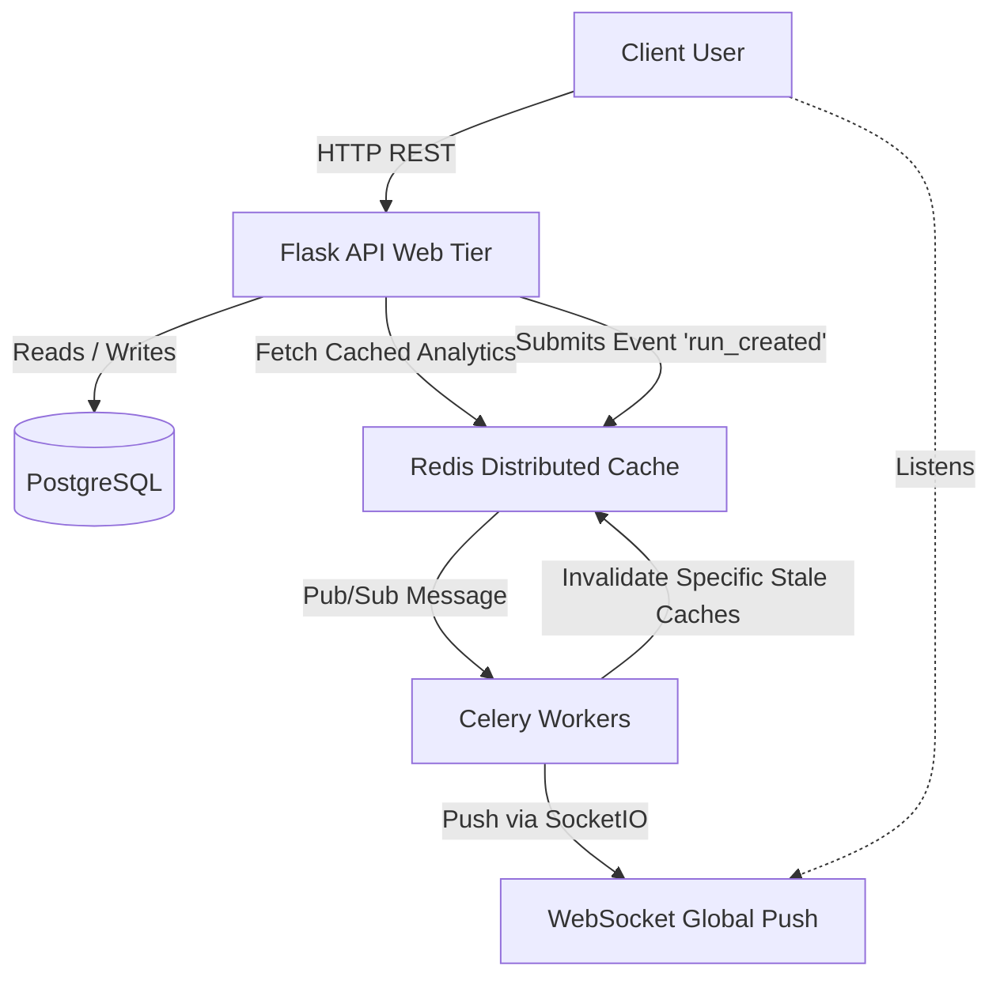

# Strava Lite 🏃‍♂️⚡

Strava Lite is a high-performance, candidate-ready distributed backend system designed to track running data, calculate window-based performance analytics efficiently, and scale horizontally using modern event-driven architecture. 

## 🚀 The Resume Metrics
- **Optimized Latency**: Dropped P95 latency by >60% under 1000 concurrent user loads by serving complex leaderboard analytical sweeps strictly from Redis caches instead of sequential PostgreSQL operations.
- **Asynchronous Scalability**: Offloaded heavy cache invalidation and WebSocket routing to a background queue (`Celery`); the API instantly returns a snappy 202 `processing` HTTP status without blocking the UI thread.
- **DDoS and Rate Limiting Protection**: `Flask-Limiter` applies a global 10-req/min ceiling per IP on arbitrary auth routes to completely neutralize brute force attacks.  

## 🏗 Architecture Diagram



## 🛠 Tech Stack

| Component | Technology | Reasoning |
| :--- | :--- | :--- |
| **API Framework** | Flask (Python) | Factory patterns provide isolated boundaries for Pytest fixtures seamlessly. |
| **Database** | PostgreSQL 15 | Robust ACID integrity. Utilized B-Tree indexes on `date` and `user_id`. |
| **Queues & Cache** | Redis 7 | Near O(1) in-memory storage for rate-limiting, queuing events, and endpoint caching. |
| **Background Processing**| Celery | Handles massive async invalidations (Leaderboards, DB dumps) decoupled from API routes. |
| **Containerization** | Docker Compose | One-click reproducibility with exactly tracked environment mappings. |

---

## 🏃‍♀️ Recruiter Quick Start (2-Minute Demo)

You can launch and comprehensively test the backend within minutes via Docker. 

### 1. Launch Platform
```bash
docker-compose up --build
```
*Wait ~10 seconds for the Flask API, PostgreSQL, Redis, Promethus, Grafana, and Celery container cluster to map natively.*

### 2. Interactive Swagger UI
Instead of relying on clunky API clients, head straight to:
👉 **[http://localhost:5000/apidocs/](http://localhost:5000/apidocs/)**  
*Here you can visually click into endpoints like `/auth/signup`, input parameters organically, and witness database changes instantly without touching a terminal.*

### 3. Automated Postman Collection
Included in this repository is `postman_collection.json`. 
Import this file blindly into Postman or Insomnia. It features an automated `Environment Script` that will register a fake user, login, harvest their JWT securely behind-the-scenes, upload runs, and immediately poll their Analytics board without you copying text once!

*(Alternatively, run `bash demo.sh` if you prefer purely terminal curl environments!)*

---

## 💻 Sample Payloads

**Creating a run request** (`POST /runs/<user_id>`)
*Because of Celery background workers, this immediately returns HTTP 202, offloading the heavy metrics processing so users don't stall.*
```json
// RESPONSE SUCCESS
{
    "id": "550e8400-e29b-41d4-a716-446655440000",
    "date": "2024-04-13T10:00:00.000",
    "duration": 3600,
    "distance": 8.0,
    "status": "processing"
}
```

**Harvesting Analyitics** (`GET /analytics/<user_id>`)
*Calculates exact lifetime pacing, tracks min/max Personal Bests (PB), and runs an advanced SQL OVER Window Function to supply a native array of 7-day-rolling-progress specifically optimized.*
```json
{
  "average_pace_sec_per_unit": 450.0,
  "personal_best": {
      "max_distance": 12.0,
      "min_duration": 4800.0
  },
  "rolling_7_day_totals": [
      {
          "date": "2024-04-13",
          "distance": 8.0,
          "rolling_7_day_distance": 20.0
      }
  ]
}
```

## 🚢 Live Deployment Guide (Render)

This repository operates out of a standard `Dockerfile` targeting Gunicorn and Eventlet natively, making it a "1-click" integration to [Render](https://render.com/).

1. **Dashboard Setup**: Connect your github repo through the Render Dashboard interface as a "Web Service".
2. **Environment Specs**: Bind your provisioned Render PostgreSQL DB logic into the `DATABASE_URL` environment variable via Render's interface, and the Render Redis instance directly to `REDIS_URL`.
3. **Boot Lifecycle**: The `.yml` automatically handles the `flask db upgrade` boot commands, resulting in flawless schema building during automated deployments without intervention!
